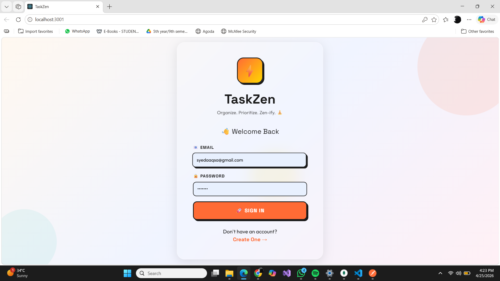
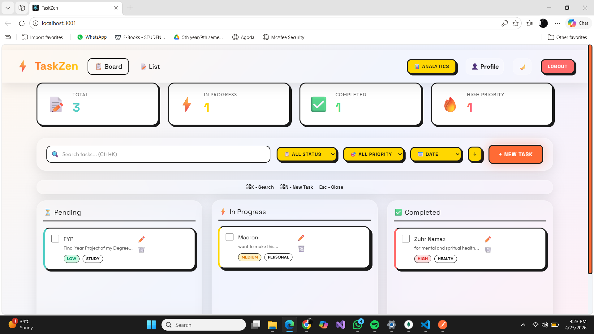
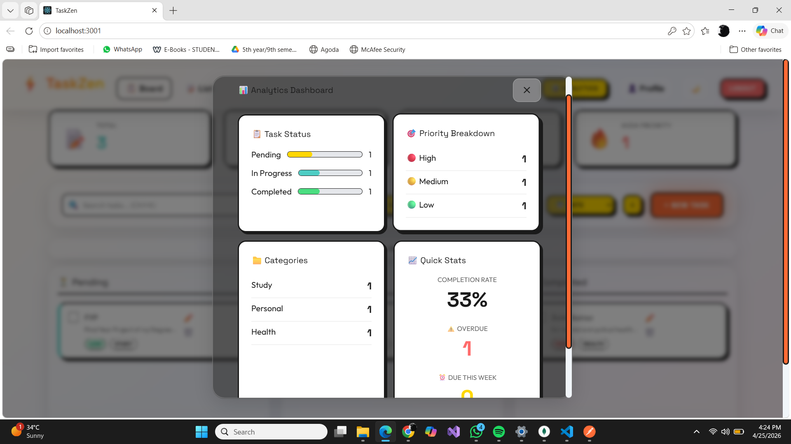
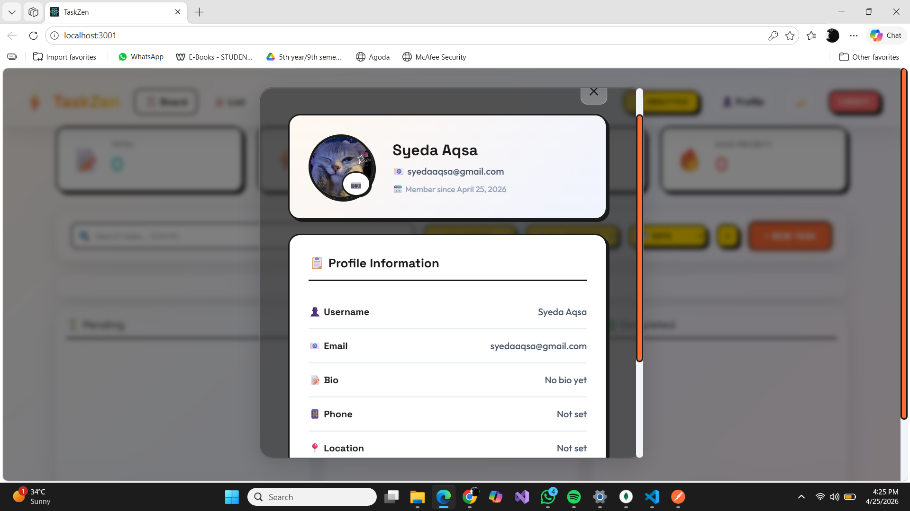

# ⚡ TaskZen - Modern Task Management System

A professional task management application built with **Neubrutalism + Glassmorphism** design, featuring drag & drop, analytics, and real-time productivity tracking.


---

## ✨ Features

### 🔐 Authentication
- User Registration & Login
- JWT-based secure authentication
- Profile management with avatar upload
- Password change functionality

### 📋 Task Management
- Create, Read, Update, Delete tasks
- **Drag & Drop** Kanban Board view
- Priority levels (High, Medium, Low)
- Categories (Work, Personal, Study, Health, Finance)
- Tags system for better organization
- Due date tracking
- File attachments support
- Comments on tasks

### 🎯 Advanced Features
- **Analytics Dashboard** (charts & statistics)
- **Bulk Actions** (delete multiple, update status)
- **Undo Delete** functionality
- **Search & Advanced Filters** (status, priority, sort)
- **Dark/Light Mode** toggle
- **Keyboard Shortcuts** (Ctrl+K, Ctrl+N, Esc)
- Export-ready task data
- Overdue task tracking

### 🎨 UI/UX
- **Neubrutalism + Glassmorphism** design fusion
- Responsive design (mobile, tablet, desktop)
- Smooth animations & transitions
- Professional color palette
- Modern typography (Space Grotesk + Outfit)

---

## 🛠️ Tech Stack

| Frontend | Backend | Database |
|----------|---------|----------|
| React.js | Node.js | MongoDB |
| Tailwind CSS | Express.js | Mongoose ODM |
| Axios | JWT Auth | |
| React Router | Bcrypt | |

---

## 📸 Screenshots

### Login Page


### Dashboard


### Analytics


### Profile


---

## 🚀 Installation & Setup

### Prerequisites
- Node.js (v14 or higher)
- MongoDB (local or Atlas)
- npm or yarn

### Backend Setup

```bash
# Clone repository
git clone https://github.com/YOUR_USERNAME/task-management-system.git
cd task-management-system/backend

# Install dependencies
npm install

# Create .env file
echo "PORT=5000
MONGODB_URI=mongodb://localhost:27017/taskmanager
JWT_SECRET=your-secret-key" > .env

# Start server
npm run dev